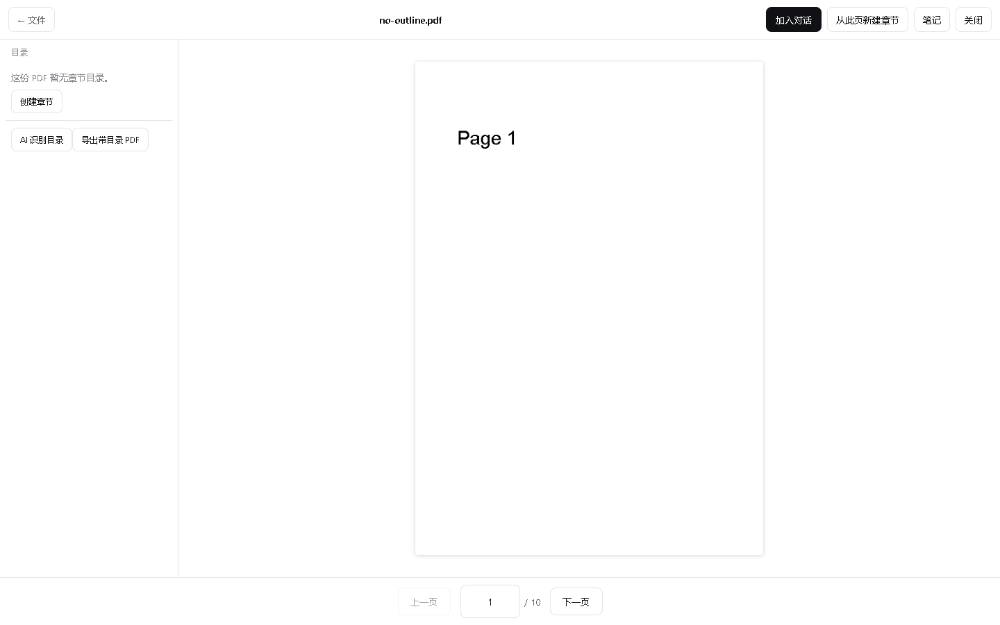
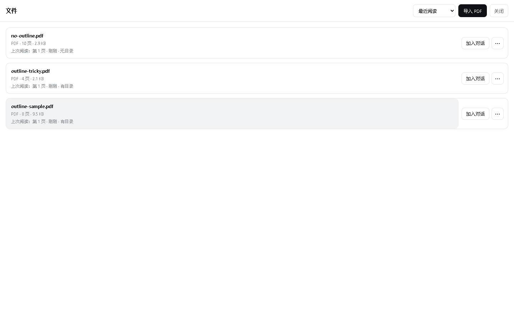
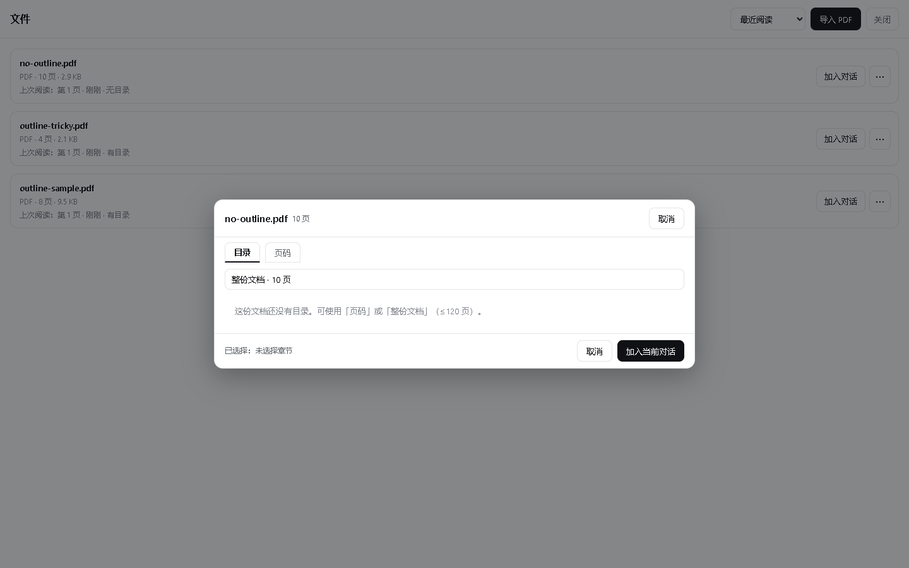
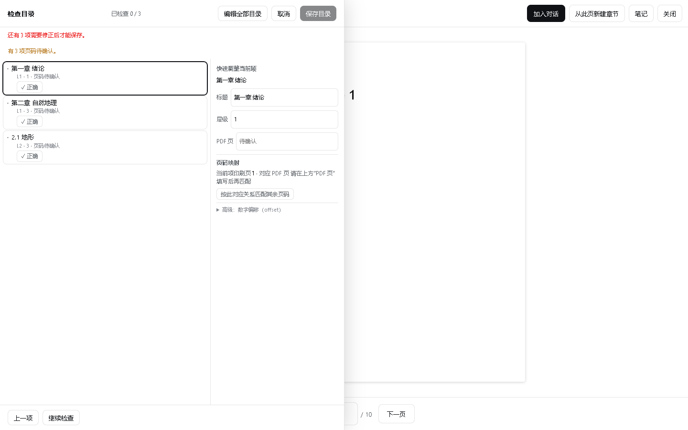
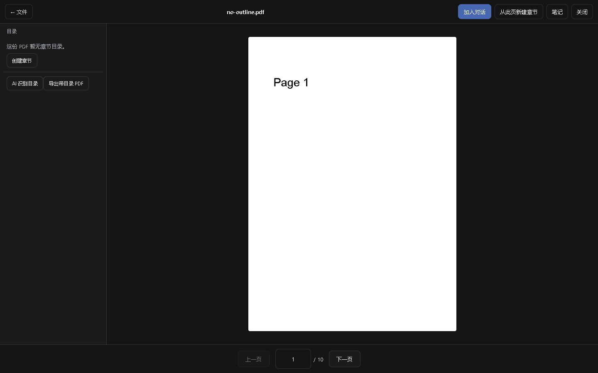
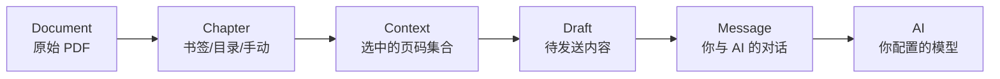
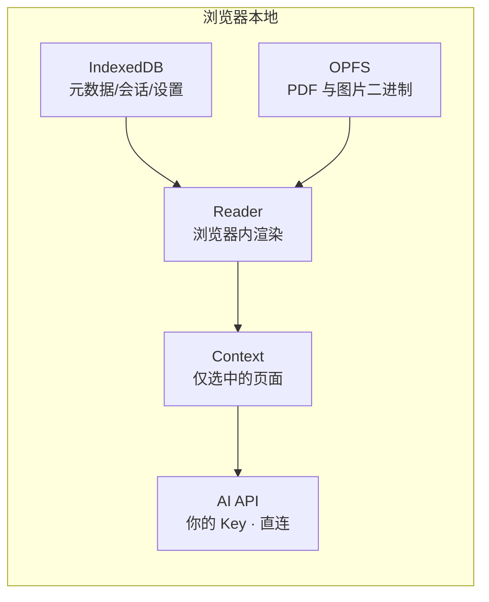
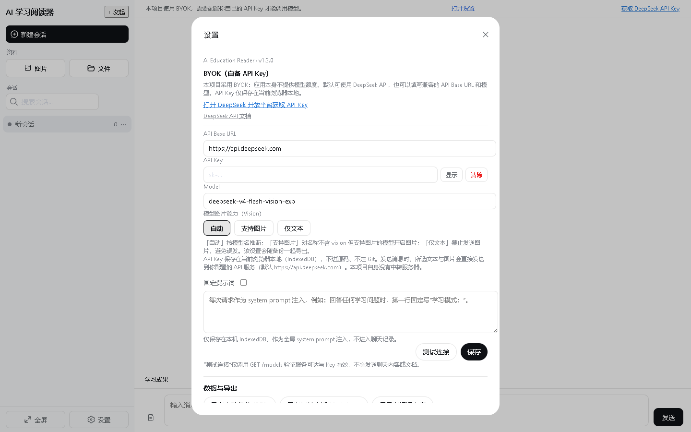

# 📚 AI Education Reader

<div align="center">

**为真正的学习阅读设计的 Local-first AI Reader**

导入一份 PDF，选真正要学的那一章；AI 只读你选中的上下文，然后针对它作答。

[🚀 在线体验](https://beichen126.github.io/ai-education-reader/) · 
[快速开始](#quick-start) · 
[功能演示](#-核心体验) · 
[隐私说明](#privacy--local-first) · 
[Roadmap](docs/ROADMAP.md)


</div>

---



## 30 秒看懂

你上传正在学的教材 PDF。导入一次，之后可以反复从文件资料库选择不同章节加入不同对话。
AI 只阅读你选中的那几页，然后针对它回答。

与传统"先让模型读完整个 PDF、再用向量检索去猜你在问哪"的方式不同，这里 **Context 完全由你控制**：
你告诉 AI 该看什么，而不是让 AI 自作主张。

## 🧭 核心体验

<table>
<tr>
<td align="center"><br/>文件资料库</td>
<td align="center"><br/>从资料库加入对话</td>
</tr>
<tr>
<td align="center"><br/>AI 目录 · 人工检查</td>
<td align="center"><br/>系统 / 浅色 / 深色</td>
</tr>
</table>

## 核心工作流

<details>
<summary><b>Document → Chapter → Context → Draft → Message → AI</b></summary>



导入的 PDF 是**独立的一等学习对象**（Document），可反复被不同对话复用；
每次只把某几页（Context）加入当前对话，AI 只看到这部分。
</details>

<details>
<summary><b>浏览器本地 —— 元数据、二进制、Context</b></summary>



完整 PDF **不上传**；只有选中的页面图片才进入 AI 请求。
</details>


## 为什么要把 Context 交给用户？

读教材时，你其实知道自己在学哪一章 —— "我现在要学 3.2 节"是明确目标。
与其先把整本书向量化、再从知识库检索，不如直接让 AI 看你选中的那几页：更快、更省、上下文更可控。
RAG 适合"不知道内容在哪"的开放式问答；而学习阅读，你一直都知道自己要学哪。

### 导入一次，反复用

一份 PDF 只导入一次。之后无论开多少个对话，都可以从**文件资料库**反复选择不同章节加入。


### 正在读某页，也能就近把章节加进去

在 Reader 里读到第 3 层的某一小节时，可以直接把当前页、所在小节、或整章/整卷加入对话，
无需手动换算页码。


## 功能现状（v1.0.0 · release candidate）

### SHIPPED ✅

| 功能 | 说明 |
|---|---|
| Image Vision Chat | 上传教材页 / 习题 / 板书图片，直接提问 |
| PDF Reader | 浏览器内渲染整份 PDF，目录 + 页码导航，自动恢复阅读位置 |
| Document Library | 本地保存导入的原始 PDF，作为独立学习对象 |
| 已有 Document → Context | 从资料库选章节加入任意对话 |
| 父级章节 Context | 读到任意层级，可加入其父级章节、不用手动算页码 |
| 多章节 Context | 一次选多个（不连续）章节，规范化为一个 Context |
| 原生 TOC | 读取 PDF 自带书签目录 |
| 手动 TOC | 无书签时手动创建 / 编辑章节树 |
| AI TOC | 视觉模型识别目录页 → 全局结构 → 人工检查后保存 |
| AI TOC 人工检查 | 逐项跳转、调整层级、待确认页码、统一偏移重算 |
| OPFS | 大二进制（PDF/图片）优先存 OPFS，自动回退 IndexedDB |
| 备份 / 恢复 | 完整备份 JSON；不含 API Key |
| 导出带书签 PDF | 把当前章节树导出为新的带 Outline 的 PDF |
| 导出 Markdown + 图片 ZIP | 会话转 Markdown + 全部图片，自包含 |
| 系统 / 浅色 / 深色 | 设计 token 层统一换肤，深色低眩光 |
| 桌面 / 平板 / 手机 | 响应式；无动画依赖，E-Ink 友好 |

### NOT SHIPPED 🚧

- **PPTX 导入**：v1.0.0 未针对 fidelity gate 验证浏览器内 PPTX→PDF 渲染器，故未开放（见 [Roadmap](docs/ROADMAP.md)）。
- 云同步 / 登录 / 账户：不包含。
- PDFium 备用渲染后端：未包含（纯 PDF.js）。


## Quick Start

**BYOK（Bring Your Own Key）**：应用本身**不提供任何模型额度**，需要你自备一个 DeepSeek API Key。
API Key 只保存在当前浏览器本地，不进入源码、不走 Git。

1. 打开 [在线体验](https://beichen126.github.io/ai-education-reader/)
2. 到 [DeepSeek 开放平台](https://platform.deepseek.com/) 获取一个 API Key
3. 打开应用右上角「设置」，填入 DeepSeek API Key（默认 Base 已指向 DeepSeek，也可改用兼容端点）；
4. 导入一份 PDF（导入一次即可）；
5. 在文件资料库选择某一个章节 / 页码范围加入当前对话；
6. 针对你选中的内容输入问题，AI 只参考这个 Context 作答。



> 没有 API Key 也能浏览界面，但无法调用模型。项目自身没有中转服务器 —— 浏览器直连你配置的 API。

## Privacy & Local-first

- **元数据 / 会话 / 设置**：保存在浏览器 IndexedDB。
- **大二进制（原始 PDF、图片附件）**：优先保存在 OPFS（Origin Private File System，仅当前站点 origin 可访问），不支持 OPFS 或写入失败时自动回退 IndexedDB。
- **打开 / 阅读 PDF**：不会把整个 PDF 上传到任何服务器；PDF 由 PDF.js 在浏览器本地读取与渲染。
- **AI 目录识别**：只有你主动勾选的目录页图片会发送到你配置的模型 API。
- **聊天**：只有你显式放入 Context / 消息的内容，才会在你发送时发送到你配置的 API。
- **本项目没有产品后端 / 无中转服务器**。

详见 [PRIVACY.md](./PRIVACY.md)。


## 设备与兼容

- **桌面 / 平板 / 手机**：响应式布局，小屏自动折叠侧栏。
- **E-Ink 友好**：不依赖动画与深色渐变动效，墨水屏上也能稳定阅读。
- **持久化存储**：应用启动时请求浏览器授予持久化存储（best-effort，不阻塞）。


## 架构概览

完整技术架构见 [docs/ARCHITECTURE.md](docs/ARCHITECTURE.md)。核心分层：

- **Document / Chapter / Context / Draft / Message / AI**：统一学习领域模型。
- **PDF runtime**：PDF.js（worker + WASM + CMap + fonts + ICC），浏览器内渲染。
- **Document Library**：把原始 PDF 作为一等对象保存，与会话无关。
- **OPFS / IndexedDB 拆分**：二进制走 OPFS-first，元数据走 IndexedDB。
- **Document → Context picker**：共享的章节选择器，多入口复用。
- **AI TOC**：所选目录页 → 视觉转录 → 全局结构 → 映射 → 人工检查 → ChapterNode。
- **异步所有权**：PdfSession、AbortController / generation token，保证取消与切换安全。


## Development

```bash
npm install
npm run dev          # 开发模式（Vite）
npm run typecheck    # 类型检查
npm test             # 单元/领域测试（test:all，无网络）
npm run build        # 产出 dist/
npm run preview      # 预览 production build
npm run docs:screenshots   # 由真实 production build 生成 README 截图
```

测试全貌见 [docs/TESTING.md](docs/TESTING.md)。

## 已知限制

- AI 调用依赖 BYOK；视觉能力取决于你所配置的模型。
- 单次 PDF Context 最多 120 页；超过 30 页会二次确认。
- 备份为 V2 Base64 JSON，大资料库时内存占用较高。
- 交互式 PDF JS / 3D / 嵌入媒体不在范围内。
- PPTX 导入（Planned）本版本未开放。

## Roadmap

详见 [docs/ROADMAP.md](docs/ROADMAP.md)。方向包括：

- 更大上下文的传输方式（Files API）；
- 更完整的 PDF 阅读工作区；
- PPTX 导入（浏览器本地转换 → 复用完整 PDF 链路）；
- PWA 离线使用。

## 参与贡献

欢迎 PR 与 Issue。请使用仓库内的 Issue 模板，且**不要**在 Issue 中提交 API Key、备份 JSON 或私人教材。

## License

[MIT](./LICENSE)。代码与设计 token 部分来自 DeepSeek Harness (DSH) 上游 Web UI（MIT，版权归 DeepSeek，
见 [THIRD_PARTY_NOTICES](./THIRD_PARTY_NOTICES)）；PDF.js (pdfjs-dist) 为 Apache-2.0。

