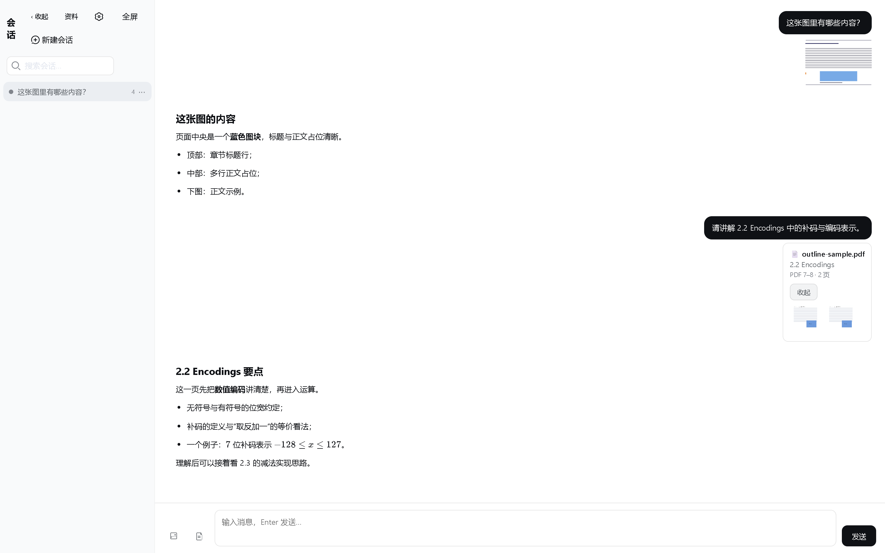

# 📚 AI Education Reader

<div align="center">

**让 AI 真正阅读你正在学习的那一章。**

Select the pages you're actually studying. Let the model see exactly that context.

[🚀 在线体验](https://beichen126.github.io/ai-education-reader/) ·
[使用说明](#quick-start) ·
[报告问题](https://github.com/beichen126/ai-education-reader/issues) ·
[参与贡献](./CONTRIBUTING.md)


</div>

---

### 🚀 Try it online

**https://beichen126.github.io/ai-education-reader/**

Alpha 已可实际使用：打开即可上传图片或 PDF 开始学习（需要自带 DeepSeek API Key，BYOK）。



---

## What is AI Education Reader?

AI Education Reader 是一个**本地优先（Local-first）的 AI 学习阅读器**。你上传正在学的教材图片或 PDF，选择真正要学的那几页，AI 只阅读你选中的内容，然后针对它回答问题。

它把"AI 该看哪里"这件事交还给你（**User-controlled Context**）：你控制 AI 的上下文，而不是让 AI 先"读完"整本书、再靠向量检索去猜你在问哪里。

PDF 在浏览器本地渲染（PDF.js），会话、图片、标注都保存在浏览器里；发送消息时，浏览器直连你自己配置的 API 服务（**BYOK**），没有中转服务器。

## Features

- **上传图片直接提问** —— 教材页、习题、笔记、板书截图
- **PDF 按书签选章节** —— 有 Outline/Bookmarks 的 PDF 直接选章节；无书签可手动选页
- **PDF Context Group** —— 选中的页面作为一个整体小组加入学习上下文
- **大章节 Context** —— 30–120 页的章节也能安全加入对话
- **统一图片查看器** —— 全屏缩放、平移、双指捏合、键盘操作，消息图片 / 待发送图片 / PDF 页面三条入口一致
- **本地优先** —— 打开 PDF ≠ 上传 PDF；数据与 Key 留在浏览器
- **BYOK** —— 使用你自己的 DeepSeek API Key（或兼容端点）
- **多设备响应式** —— 桌面 / 平板 / 手机；无动画依赖，E-Ink 友好

## How it works

```
PDF 书签 ─→ 选择章节/页码 ─→ 浏览器本地渲染选中页 ─→ PDF Context Group ─→ 提问
   或（无书签）─→ 手动选页 ──────────────────────────┘                    └─→ Vision 模型基于你选中的内容作答
```

## Why not RAG?

"我现在就要学第 3.2 节"是一个明确目标：与其先把整本书向量化、再从知识库里检索，不如直接让 AI 看你选中的那几页 —— 更快、更省、上下文更可控。

RAG 适合"不知道内容在哪里"的开放式问答；而读教材时，你其实知道自己在学哪里。

## Quick Start

1. 打开 [在线体验](https://beichen126.github.io/ai-education-reader/)
2. 进入设置，配置你自己的 DeepSeek API Key（BYOK）
3. 上传一张图片，或者打开一份 PDF（有书签按章节选，无书签手动选页）
4. 把选中的内容加入对话，开始提问

## Privacy & Local-first

- 所有数据保存在你浏览器的 IndexedDB 中，没有产品后端
- API Key 只存在浏览器本地，浏览器直连你配置的 API 服务
- 仅在你发送消息时，选中的图片 / PDF 页面与聊天上下文才会发送到你配置的 API

详见 [PRIVACY.md](./PRIVACY.md)。

## Current status

**Alpha · v0.1.0-alpha.3** —— 核心学习流程可以正常使用，正在根据真实使用反馈迭代。

已知限制（会随迭代逐步改善）：

- 单次 PDF Context 最多 120 页；单次请求图片数据有 30 MiB 内联预算
- 图片以 inline Base64 传输，尚未使用 Files API
- 需要支持视觉输入的模型（默认 `deepseek-v4-flash-vision-exp`）
- 不含 OCR / 自动目录识别：无书签 PDF 请手动选择页码
- 不含云同步 / 登录 / 账户

## Development

```bash
npm install
npm run dev        # 开发模式（Vite）
npm run typecheck  # 类型检查
npm run build      # 产出 dist/
npm run preview    # 预览 production build
```

单元测试（核心逻辑，无网络）：

```bash
npm run test:zoom               # 缩放/平移数学
npm run test:pdf-outline        # PDF 书签解析
npm run test:pdf-attach         # PDF 页面附件
npm run test:attachment-display # 附件分组展示
npm run test:large-context      # 大上下文安全
```

## Contributing

欢迎 PR 与 Issue —— 在 [CONTRIBUTING.md](./CONTRIBUTING.md) 了解流程，使用仓库内的 Issue 模板报告问题或功能建议。

**请不要在 Issue 中提交 API Key、备份 JSON 或私人教材。**

## Roadmap

Roadmap 由真实使用反馈驱动（feedback-driven），不承诺日期：

- 更完整的 PDF 阅读工作区
- 更大上下文的传输方式（Files API）
- PWA 离线使用

欢迎通过 Issue 提供你的使用反馈。

## License

MIT License（见 [LICENSE](./LICENSE)）。

- 代码与设计 token 部分来自 DeepSeek Harness (DSH) 上游 Web UI：MIT，版权归 DeepSeek（见 [THIRD_PARTY_NOTICES](./THIRD_PARTY_NOTICES)）
- PDF.js (pdfjs-dist)：Apache-2.0，Mozilla 基金会
- 其余依赖见 [package.json](./package.json)
