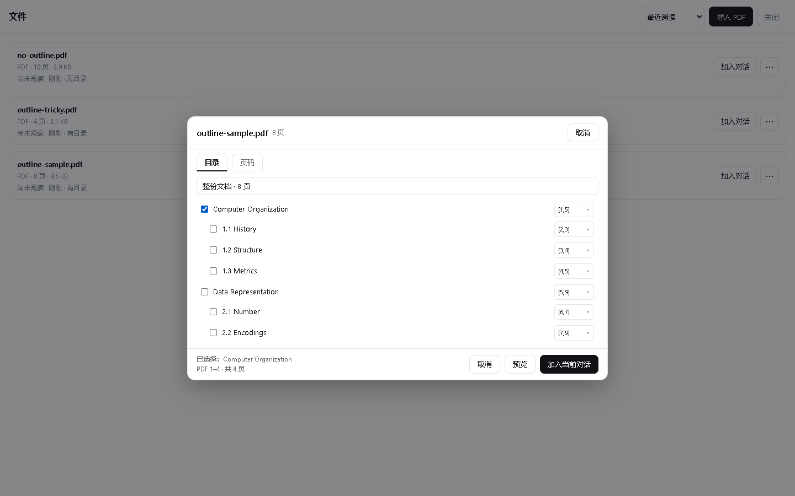
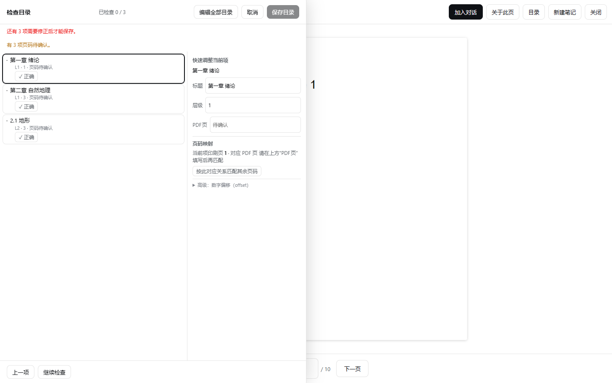
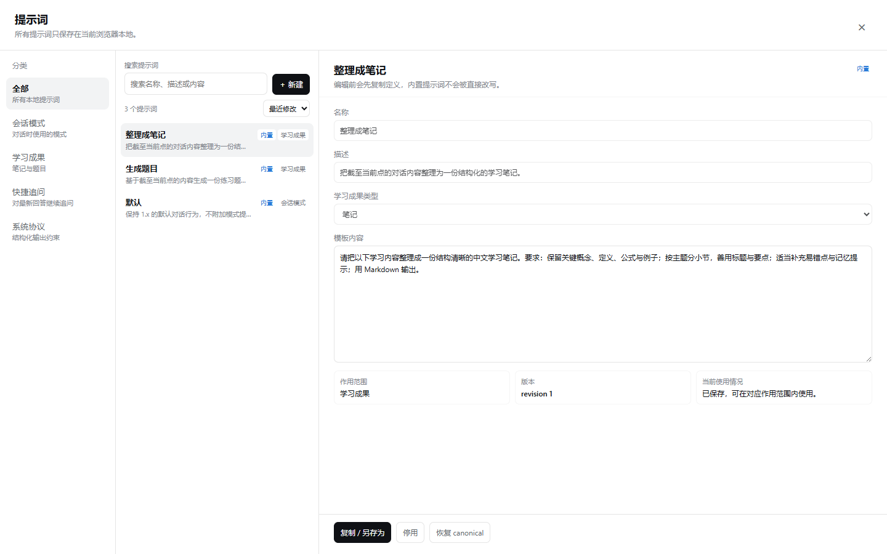

# 📚 AI Education Reader

**把教材、论文和讲义变成可以直接提问、反复核对和持续复习的学习桌面。**

导入教材 → 选章节或页码 → 让 AI 只看你指定的内容 → 把回答、笔记和学习成果留在原文旁边。

[🚀 在线体验](https://beichen126.github.io/ai-education-reader/) ·
[第一次使用](#第一次使用) ·
[常见问题](#faq) ·
[设计理念](#设计理念问完还能回到原文) ·
[隐私与备份](#数据隐私与备份) ·
[Roadmap](docs/ROADMAP.md)

---

## 产品一句话介绍

AI Education Reader 是一个在浏览器里使用的学习工具：你把教材、论文、习题集或讲义放进来，直接向 AI 提问；需要确认答案时，可以回到原文的页码继续看，也可以把回答整理成笔记和题目。

你可以先在本地打开资料、阅读 PDF、整理目录和做页面笔记；需要 AI 时，再配置自己的模型服务。

## 30 秒理解本产品

你只需要记住一条流程：

1. 打开产品，第一屏就是 **AI 对话**；
2. 需要依据教材时，从“文件”里打开 PDF，选中当前页或章节，把渲染出来的图片带入这次对话；
3. AI 回答后，你可以：
   - 点击左侧边栏的按钮，打开已发送的图片，理解教材/习题/论文的原文脉络；
   - 在前几轮会话的基础上，继续追问、做笔记或生成题目。

没有 API Key 时，仍然可以导入、阅读、整理目录和做本地页面笔记；配置自己的 API 后，才会发送页面并获得 AI 回答。

打开后先看到的是对话输入框和会话列表；资料库、原文页面、页面笔记和左侧边栏都围绕“提问—回看—再提问”这件事展开。

## 与 Zotero 等 PDF 阅读器有什么不同？

一句话：**Zotero 等阅读器的页面是为“读 PDF”设计的；AI Education Reader 的首屏是为“和 AI 围绕 PDF 对话”设计的。**

最直观的区别是：**打开 Zotero，你先面对一页 PDF；打开本产品，你先面对一场 AI 对话。**

- Zotero 适合收藏文献、管理作者和引用、做传统批注，以及认真读完一篇 PDF。
- 本产品适合边读边问：从教材里选一页或一章给 AI，看完回答还能快速打开 PDF，回到原文，然后继续追问、记笔记和复习。
- 它不是要替代 Zotero；如果你要的是文献管理，选 Zotero；如果你要的是围绕教材学习，选本产品。

PDF 的目录、页码、笔记和来源仍然保留在本地，回答不会把原文变成一次性附件。

## 与 ChatGPT/DeepSeek 等 AI 网页端有什么不同？

最直观的区别是：**网页端 AI 把附件和图片顶在聊天最上方；本产品让你随时从左侧边栏回到已经发送的图片、PDF，以及其他本地资料。**

- **网页端 AI 的附件是聊天内容的一部分。** 文件和图片通常显示在消息顶部；当你想重新理解某句话时，还要在聊天记录中翻找附件，原文的章节、页码和其他资料不一定仍然在手边。
- **本产品的附件是本地资料的一部分。** 发送过的 PDF、图片和其他本地文件仍可从左侧边栏的“文件”“图片”入口打开；不需要回到旧消息顶部寻找，也可以直接查看同一资料库里的其他文件。
- **对话和原文可以来回走。** 消息保留来源文档与页码；你可以从回答回到原文，也可以从资料库重新选择其他页、章节或另一份资料，再发起下一轮对话。
- **发送范围仍由你控制。** 只有你选择的页面会生成图片上下文并发送，不会因为打开 Reader 就默认上传整本 PDF。

本产品不提供模型本身，也不替你托管 API；你仍需配置 DeepSeek 或其他兼容接口。它解决的是“资料发出以后还能不能回到原文、继续查别的本地资料”这个问题，而不是另一个模型聊天网站。

## FAQ

下面先回答第一次使用时最容易遇到的问题；具体操作步骤和功能说明见后文。

### 1. PDF 是整本发送给 AI 吗？

不是。只有你在 Context 中选择的页面会被渲染成图片并加入本次请求；打开 Reader、翻页或打开资料库不会自动上传整本 PDF。

### 2. 选中的 PDF 页以什么形式发送？

浏览器先在本地把选中页面渲染为图片上下文，再随你的问题发送给兼容接口。模型是否支持图片理解由你配置的模型决定。

### 3. PDF 原文件存在哪里？

默认在当前浏览器的本地存储中：优先使用 OPFS，不可用时使用 IndexedDB。产品没有用于存放教材的云端账户或同步后端。

### 4. 清除浏览器数据或更换浏览器会怎样？

当前浏览器中的资料、会话和页面笔记可能随本地数据一起被清除。迁移前先导出 Backup，并保留需要重新导入的原始 PDF。

### 5. API Key 存在哪里，会进入备份吗？

API Key 只保存在当前浏览器的本地设置中，不进入 Backup JSON，也不会写入仓库或产品后端。

### 6. 为什么需要支持图片理解的模型？

PDF 页面和目录页需要先渲染成图片，才能让模型理解版式、公式、图表和目录结构。纯文本模型可能无法完成这些视觉任务。

### 7. 自定义模式是什么，如何新建和切换？

模式是一组告诉 AI“如何讲解”的规则。打开 Prompt Manager，进入会话模式并新建一个模式；保存后可以在当前会话或分支的模式选择器中切换。新模式从下一条消息生效。

### 8. 模式切换会改变以前的回答吗？

不会。模式快照会随消息记录，切换只影响之后发送的消息，历史回答仍保留原来的讲解方式。

### 9. 快捷追问是什么，它是否进入会话历史？

快捷追问是预先准备的真实问题。点击后会作为用户消息发送并进入会话历史，可以继续生成回答或沿来源回到 PDF。

### 10. 如何生成笔记、摘要和题目？

先在会话中准备 PDF 上下文，再打开学习成果。选择“整理成笔记”生成可编辑 Markdown；想要摘要时可以直接要求总结或指定生成摘要式笔记；选择“生成题目”生成结构化 Quiz。

### 11. 笔记与题目的渲染为什么不同？

笔记是可编辑 Markdown，适合保存解释、要点和复习内容；题目是结构化数据，包含题干、选项、答案、解释和来源，所以使用专门的题目查看器。

### 12. AI 目录如何生成，为什么还要人工检查？

AI 先读取你选择的目录页，再提出标题、层级和页码映射。扫描质量、页码标签和版式可能造成歧义，因此保存前必须检查和修正，不能把 AI 草稿当作权威目录。

### 13. “标记”保存在哪里，可以如何导出？

消息标记和文本标注保存在当前浏览器的会话数据中，并随 Backup 导出。它们不等同于 PDF 文件内置批注；导入到另一台设备后，需要恢复对应 Backup 和资料关系。

### 14. 页面笔记与会话笔记有什么区别？

页面笔记绑定“文档 + 页码”，适合记录看到原文时的想法；会话笔记绑定一条对话中的学习上下文，适合整理回答和复习材料。两者生命周期不同，都会按各自的数据关系保存。

### 15. 如何备份和恢复？

在设置或资料库中导出 Backup JSON，安全保存文件；在目标浏览器选择导入并等待校验完成。导入支持 V1–V6，API Key 不会从 Backup 恢复，需要在目标浏览器重新配置。

### 16. 为什么某些大 PDF 首次打开较慢？

浏览器首次打开需要读取本地 PDF、建立页面尺寸和渲染首屏；大文件、复杂字体和 OPFS 冷读会增加时间。后续打开通常可以复用已建立的本地资源。若页面持续失败，请先检查文件是否完整并重试。

### 17. 分页阅读和连续滚动如何切换？

当前稳定基线使用分页阅读；连续滚动设置和虚拟化 Reader 属于 v2.1.0 后续 Stage，发布后会在设置中提供切换。不要把当前版本不存在的入口当作已交付功能。

### 18. 单次最多能发送多少页？

单次 PDF Context 最多 120 页，超过 30 页会二次确认。超过 120 页需要缩小章节或页码范围；这只是产品安全阈值，不等同于某个模型接口的上下文上限。

## 设计哲学：PDF 是一等对象

普通聊天是“发文件—问一次—继续往下刷”。本产品希望你问完以后，还能回到教材里看清楚答案从哪里来。

这就是“PDF 是一等对象”这句话真正想表达的意思：PDF 不是某一条消息的附件，而是可以反复打开的学习资料。你导入一次，就能在不同会话中再次使用；目录、页码、页面笔记和来源也不会因为换了一个问题就消失。

对用户来说，结果很简单：

- 想问哪几页，由你自己选；
- 想回哪一页，点击来源或左侧边栏就能回去；
- 想换一本本地资料，直接从“文件”里打开，不必重新寻找旧附件；
- 想把回答留下来，可以整理成笔记、摘要式笔记或题目。

## 功能亮点

### 把 PDF 变成可长期使用的资料

导入后，PDF 会进入本地资料库，拥有自己的名称、页数、目录、阅读位置和文档身份。资料库先读取轻量元数据，打开 Reader 时再按需读取 PDF 二进制；同一份资料可以服务多个学习任务。

### 目录不是黑盒结果，而是可检查的学习结构

有原生书签时可以直接使用；没有目录时，可以在 Reader 内创建和编辑章节。AI 目录工作流会先选择目录页，再进行视觉转录、结构分析和页码映射，最后由你检查、调整并保存。它不会把不确定的页码悄悄猜成确定结果。

### 只把必要页面交给 AI

从资料库或 Reader 可以选择整份文档（受单次页数限制）、当前页、章节、父级章节，或者多个不连续页码。选择器会规范化并去重，实际生成的上下文只包含选中的页面。

书签范围的边界可在下拉栏选择 `[)` 或 `[]`：前者表示包含开始页、不包含结束页，即左闭右开；后者表示两端都包含，即左闭右闭。设置会保存到文档与同层级章节，刷新、关闭再打开仍会保留；没有旧设置的文档安全默认使用 `[)`。预览和按钮直接使用符号表达，不额外堆叠“实际发送”长文案。

### 自定义会话模式：让 AI 按你的方式讲解

会话模式决定下一条消息采用怎样的讲解方式，例如更注重证明步骤、概念直觉或论文精读。新安装只显示内置“默认”，但你可以在 Prompt Manager 中创建、编辑、切换任意数量的自定义模式；切换只影响之后的消息，历史回答保留当时的模式快照。

### 把下一步问题变成快捷追问

快捷追问是预先准备好的真实问题，例如“请举一个反例”或“把这一段改写成复习卡片”。点击后它会进入当前会话历史，而不是一个只在界面上短暂出现的提示；主线和分支都可以继续使用。

### 整理笔记、生成摘要和生成题目

你可以在当前学习上下文中：

- 整理成可编辑、可导出的 Markdown 笔记；
- 生成带答案、解释和来源的结构化题目；
- 在会话中直接要求总结，或在“整理成笔记”时要求生成摘要式笔记；
- 继续使用历史版本中已经保存的总结、学习指南和自定义学习成果。

这里没有一个虚构的“摘要成果”按钮：摘要能力最终仍保存为 Markdown 笔记，题目使用独立的结构化题目查看器。

### AI 提取目录、检查并生成 PDF 书签

选择目录页后，AI 会把目录内容转录为候选结构。你可以查看标题、层级和页码映射，修正不准确的条目，再保存目录或导出带书签的 PDF。需要支持图片理解的模型，因为目录页本身是视觉内容；没有 API 时可以先阅读和编辑已有目录，但不能调用 AI 提取。

### 页面笔记、消息标记和来源回链

页面笔记按“文档 + 页码”保存，不属于某一条会话。输入会合并保存，切页、关闭 Reader、切换文档和离开页面时会 flush，避免逐键写入和旧异步保存覆盖新内容。

消息中的 PDF 来源可以回到对应文档和页码；Reader 的“相关会话”可以找到当前文档当前页的历史消息。消息标记和文本标注属于会话内容，页面笔记属于 PDF 文档，两者用途不同但都可随 Backup 迁移。

### 侧栏和资料库让原文一直可打开

PDF 和图片不会在发送消息后消失。侧栏可以打开资料库、历史会话和设置；收起后仍保留原来的 rail 直接入口。资料库中的 PDF 可再次打开 Reader、选择 Context 或继续查看目录。桌面、平板和手机使用相同的资料—Reader—对话语义。

## 页面展示

下面只保留能说明产品工作方式的关键画面：首屏对话、资料库、页面选择、AI 目录检查和模式管理。移动端竖栏、深色模式、空白 Reader 和重复的侧栏状态不再占用正文空间。

图片来自当前 v2.1.0 开发线的确定性 PDF 示例，不包含个人资料或真实 API 内容。

## 第一次使用

### 只想先看看产品

打开[在线体验](https://beichen126.github.io/ai-education-reader/)，不配置 API 也可以：导入 PDF、打开资料库、阅读页面、整理目录和添加页面笔记。需要对话、生成笔记或题目、AI 提取目录时，再到设置中配置 API。

### 需要使用 AI

1. 准备 DeepSeek API Key，或一个兼容 OpenAI Chat Completions 的服务；
2. 打开侧栏中的“设置”，填写 API Base URL、Key 和模型；
3. 导入一份 PDF，等待它出现在“文件”资料库；
4. 打开 Reader，选择当前页、章节或页码范围；
5. 点击加入对话，输入问题并发送；
6. 通过回答中的来源回到 PDF，继续做页面笔记或生成学习成果。

API Key 是你自己的服务凭据。应用不提供模型额度，也没有产品后端中转；浏览器直接请求你配置的服务。

## 导入和阅读 PDF

从侧栏打开“文件”，选择 PDF 文件。导入完成后，资料库会显示文件名、页数、目录和最近阅读位置。点击“阅读”打开 Reader：

- 使用目录快速跳转；
- 使用页码输入跳到指定页面；
- 从当前页面打开页面笔记；
- 从章节或当前页打开 Context 选择；
- 在分页模式下逐页阅读（连续滚动将在后续版本提供设置）。

原始 PDF 由浏览器本地 PDF.js 读取和渲染。仅打开或翻阅 Reader 不会把原始 PDF 上传到产品服务器。

## 选择页面/章节加入对话

从资料库卡片或 Reader 打开“加入对话”：

1. 勾选一个或多个章节，或者输入开始页与结束页；
2. 需要时选择 `[)` / `[]` 边界；
3. 查看页面数量和预览；
4. 点击“加入当前对话”；
5. 返回会话后，发送你的问题。

Context 只描述本次消息需要的页面，不改变 PDF 的原始文件。一次最多选择 **120 页**；超过 **30 页**会先要求确认，超过 120 页会阻止发送。页面最终会在浏览器中渲染为模型可接收的图片上下文，实际是否能处理还取决于你配置的视觉模型和接口限制。

## 数据、隐私与备份

- **原始 PDF 默认留在浏览器本地。** 二进制优先保存到 Origin Private File System（浏览器的本地文件空间，简称 OPFS）；不可用或写入失败时回退到 IndexedDB（浏览器本地数据库）。
- **API 请求由浏览器直连你的服务。** 只有你显式选择的页面、输入文字和你主动发送的图片才会进入请求。
- **API Key 不进入 Backup。** Key 保存在当前浏览器本地设置中，导出的 Backup JSON 不包含它。
- **Backup 可以迁移学习关系。** Backup V6 保存文档关系、会话、分支、页面笔记、学习成果、Prompt 配置和附件元数据；旧 V1–V5 Backup 仍可导入。
- **清除浏览器数据会清除本地资料。** 更换浏览器或设备前请先导出 Backup；原始 PDF 和未写入 Backup 的本地文件需要按产品提示另行保留。

更完整的隐私说明见 [PRIVACY.md](PRIVACY.md)。

## 当前限制与故障排查

- AI 对话、学习成果和 AI 目录依赖你配置的兼容 API；没有 API 仍可本地阅读和整理资料。
- 视觉模型能力、请求大小和费用由你选择的服务决定；发送前请检查页面选择。
- 交互式 PDF JavaScript、3D 和嵌入媒体不在当前范围内。
- PPT/PPTX 导入仍是计划项；不会为了它建立与 PDF 分裂的第二套 Reader。
- 大 PDF 首次打开较慢时，先等待首屏完成，检查浏览器存储空间，再关闭其他同站点标签页后重试。
- API 请求失败时，检查 API Base URL、模型名、Key、余额/权限和模型是否支持图片；本地 PDF 无法打开时，重新导入原文件。
- 如果资料库内容即将丢失，停止清理浏览器数据，先导出 Backup；Backup 导入失败时保留原文件并查看具体校验提示，不要覆盖唯一副本。

## 开发者信息

工程安装、构建、测试、截图生成和贡献约定见 [docs/DEVELOPMENT.md](docs/DEVELOPMENT.md)。内部分层见 [docs/ARCHITECTURE.md](docs/ARCHITECTURE.md)，测试门禁见 [docs/TESTING.md](docs/TESTING.md)。

## License

[MIT](LICENSE)。代码与设计 token 部分来自 DeepSeek Harness（DSH）上游 Web UI（MIT，版权归 DeepSeek，见 [THIRD_PARTY_NOTICES](THIRD_PARTY_NOTICES)）；PDF.js（pdfjs-dist）为 Apache-2.0。
