# 📚 AI Education Reader

<div align="center">

**把 PDF 变成可以反复阅读、提问、做笔记和复习的本地学习工作区。**

导入教材 → 选章节或页码 → 让 AI 只看你指定的内容 → 把回答、笔记和学习成果留在原文旁边。

[🚀 在线体验](https://beichen126.github.io/ai-education-reader/) ·
[快速开始](#快速开始) ·
[设计哲学](#第一代产品的设计哲学pdf-是一等对象) ·
[隐私与本地优先](#隐私与本地优先) ·
[Roadmap](docs/ROADMAP.md)


</div>

---

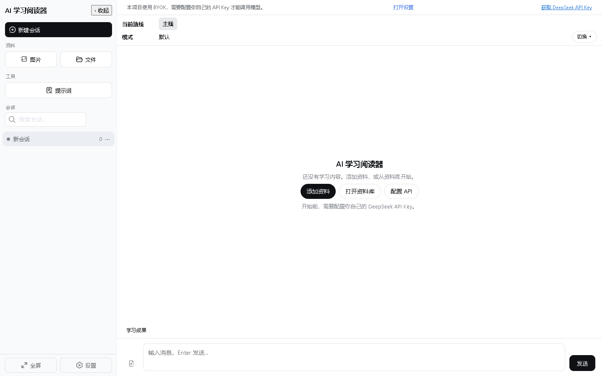

## 这是什么

AI Education Reader 是一个面向教材、论文和技术资料的 **Local-first AI Reader**。
它不把 PDF 当作一次性上传的附件，而是把 PDF 保存成一个可以长期复用的本地学习对象：

- 在资料库里保留原始 PDF、目录、阅读进度和页面笔记；
- 在 Reader 中阅读整份文档，按章节、当前页或不连续页码选择上下文；
- 把同一份 PDF 的不同章节加入不同对话，不必重复上传；
- 从消息返回原文页，也可以从原文页找到相关历史消息；
- 把回答继续加工成笔记、题目、学习指南或其他学习成果；
- 通过本地备份把这些学习关系一起带走。

模型调用采用 BYOK（Bring Your Own Key）：应用不提供模型额度，也没有产品后端中转。浏览器直接调用你配置的 API，数据默认留在当前浏览器的本地存储中。

## 第一代产品的设计哲学：PDF 是一等对象

这是这个项目最重要的产品判断：**PDF 不是会话的附件，PDF 本身才是学习工作的中心对象。**

传统聊天产品通常把文件看成某一条消息的附属物：上传、问一次、然后文件和问题一起沉入历史记录。第一代 AI Education Reader 反过来组织数据：

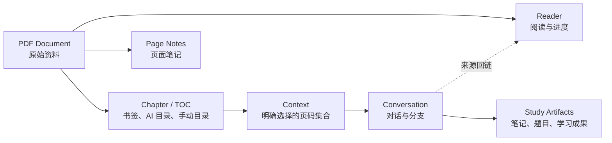

这意味着：

1. **导入一次，反复使用。** 同一个 Document 可以服务多个会话和多个学习任务。
2. **来源关系可追溯。** 消息保存文档与页码 provenance；在 Reader 中能定位相关消息，消息中也能返回来源页。
3. **上下文由学习者决定。** AI 不替你猜“整本书里可能相关的内容”，你明确选择它应该读的章节或页码。
4. **阅读状态属于文档。** 阅读进度、目录编辑、页面笔记和页面关联不会因为换了一个会话而丢失。
5. **会话是使用方式，不是资料所有者。** 删除会话不会让原始 PDF 消失；删除文档时，属于它的页面笔记也会按所有权清理。

## 一条完整的学习路径

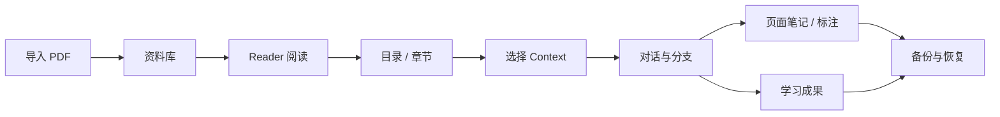

这里的关键不是“给聊天加一个 PDF 按钮”，而是把 **Document → Chapter → Context → Message → Learning Result** 做成一条可以往返、可以保存、可以复用的学习链路。

## v2.0：把“怎么学”变成可见、可复用的工作方式

v2.0 在 PDF 一等对象之上增加了一层更清晰的学习工作区。你不需要理解内部实现，只需要按四个问题找到对应入口：

| 你想解决的问题 | 对应入口 | 它会记住什么 |
| --- | --- | --- |
| 我想让 AI 怎么教我？ | **会话模式** | 从下一条消息开始采用的讲解方式；历史回答保留当时的方式 |
| 我想把内容变成什么？ | **学习成果** | 笔记、题目、总结、学习指南或自己的加工方式 |
| 我下一步经常会问什么？ | **快捷追问** | 一键发送的真实追问；仍然出现在会话历史中 |
| 软件如何指挥模型？ | **系统协议** | 可查看的目录、题目等结构化输出规则与校验说明 |

这四个入口彼此分工：会话模式决定“怎么讲”，学习成果决定“产出什么”，快捷追问负责“下一步问什么”，系统协议负责“结构化结果怎样被检查”。它们都服务于同一份 PDF 上下文，不会把资料重新变成一次性附件。

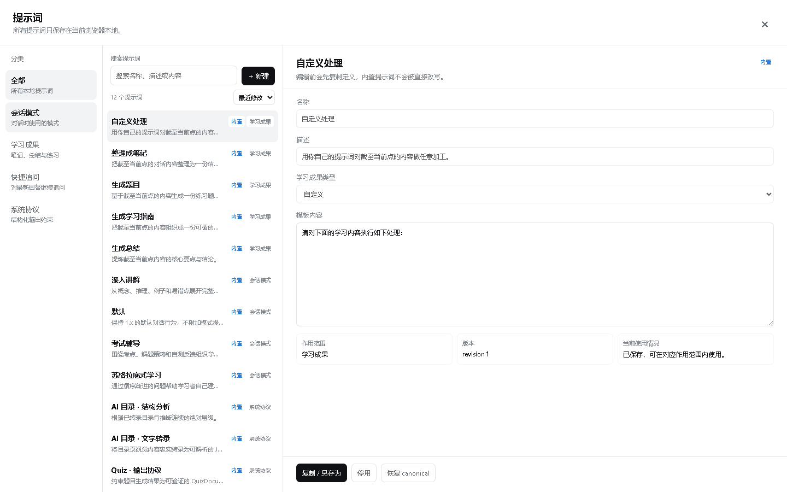

## 功能亮点

### 1. 独立的 PDF 资料库与 Reader

导入后的 PDF 会进入本地资料库，拥有自己的名称、页数、目录来源、阅读进度和文档 ID。资料库只读取元数据，打开时才按需读取二进制；同一份资料可以被多个对话复用。

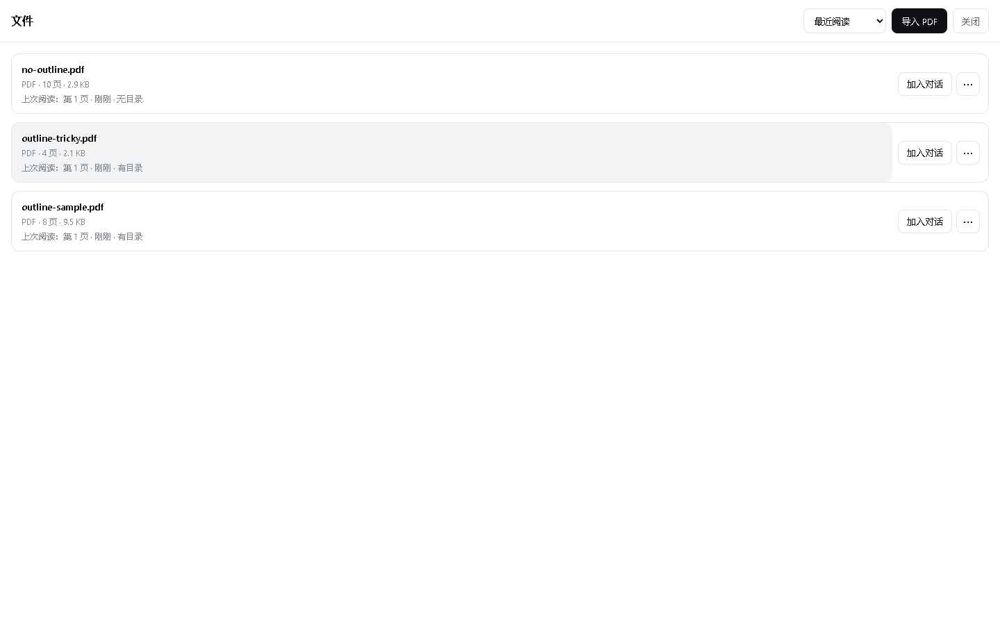

Reader 支持目录导航、页码跳转、阅读位置恢复、深色模式和响应式布局。读到某一页时，可以从当前页继续创建章节、选择 Context 或打开页面笔记。

### 2. 目录是可检查、可编辑的学习结构

项目同时支持 PDF 原生书签、无目录 PDF 的手动章节，以及 AI 辅助目录。AI 目录不是黑盒地“猜一个目录”，而是一条可检查的工作流：选择目录页 → 视觉转录 → 全局结构分析 → 页码映射 → 人工检查、调整和保存。原始 printed page label 会被保留，结构分析失败时也会给出可理解的诊断，而不是静默生成一棵看似完整的目录。

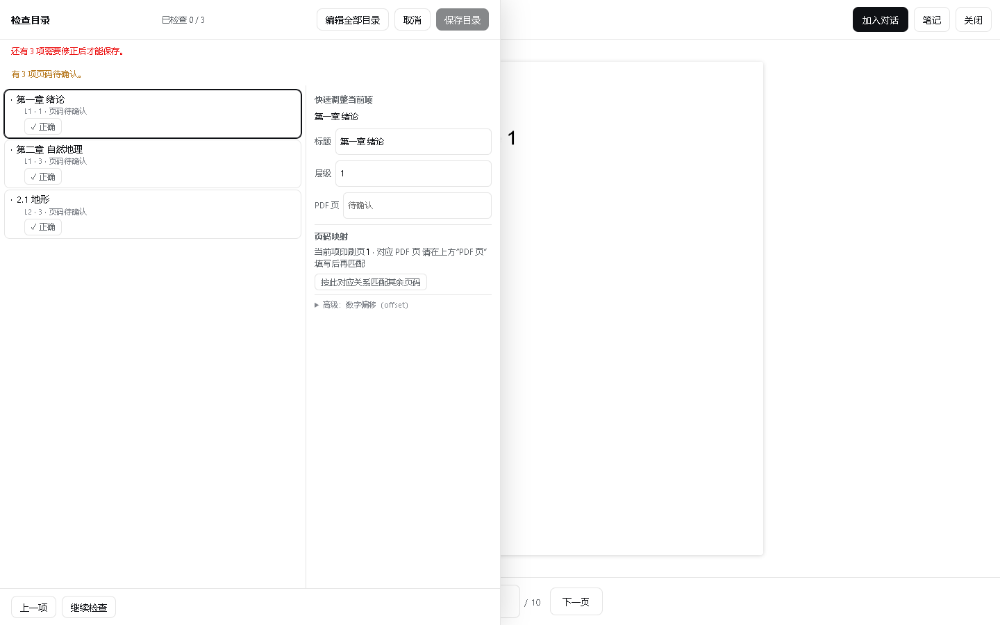

没有原生目录时，也可以在 Reader 内直接编辑章节树；章节结构保存后即可用于导航和 Context 选择。长目录支持搜索、Shift 范围选择、按当前层级选择，以及批量调整层级；这些选择只是编辑器里的临时状态，不会污染文档数据。

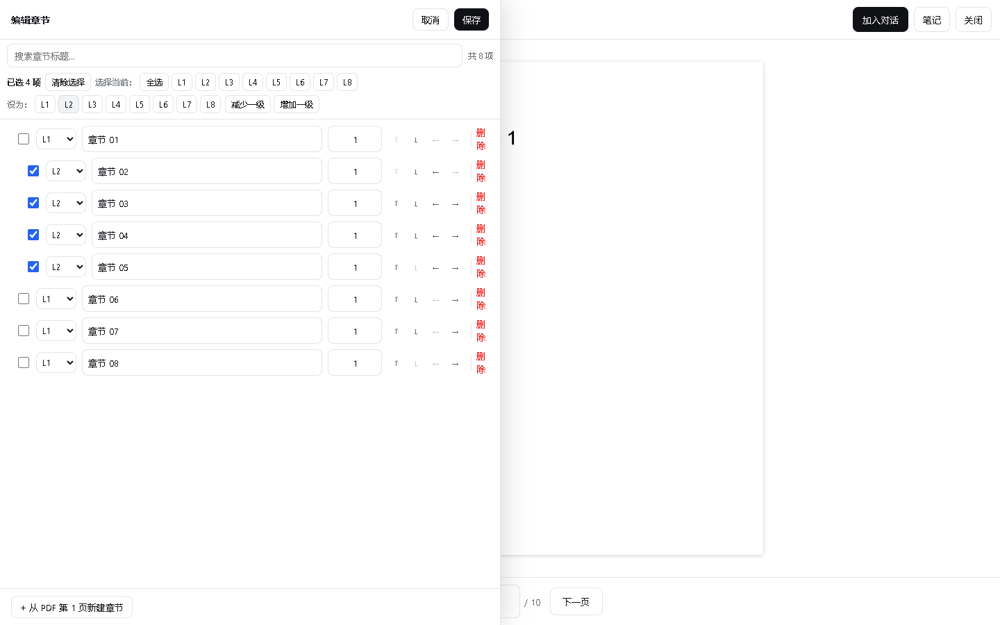

目录相关的页码映射遵循“能证明才映射”的原则：优先使用 PDF PageLabels；没有 PageLabels 时，可以用明确的单一锚点校准数字页码；非数字或不确定的页码保持待确认，不擅自猜测。

### 3. Context 由人选择，AI 只读取必要内容

你可以从资料库或 Reader 选择：

- 整份文档（在页数限制内）；
- 当前页、当前章节或父级章节；
- 多个不连续章节或页码范围；
- 不同 PDF 的页面组成同一条消息的多个来源。

选择器会把范围规范化、去重并显示实际页数。选中的页面才会被渲染为发送给模型的上下文，完整 PDF 不会因为打开 Reader 而上传。

书签范围还支持按文档、按稳定书签分别选择两种边界语义：左闭右开 `[start, end)`（例如 10–19 页）或左闭右闭 `[start, end]`（例如 10–20 页）。边界语义只需在下拉栏选择，预览使用区间符号表达；实际发送的页集合由所选模式稳定计算。设置在刷新、关闭并重开后保持，旧文档和旧备份缺少该字段时默认使用左闭右开。最后一个书签和单页章节也会自动限制在文档页数内。

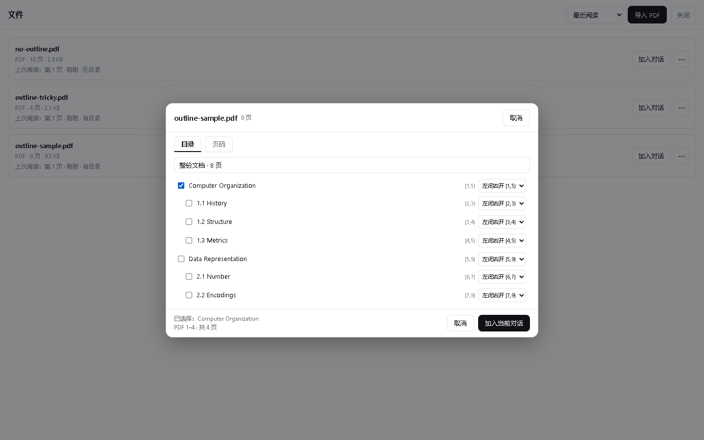

### 4. 对话、页面和来源可以双向返回

PDF provenance 不是展示用的标签，而是可操作的导航关系：

- 消息中的 PDF 来源按钮可以回到对应文档和页码；
- Reader 的“相关会话”可以列出当前文档当前页的消息；
- 点击相关消息后，会打开正确的会话、分支和具体消息位置；
- 多文档消息按 `documentId + pageNumber` 匹配，不会因为页码相同而串到另一份 PDF；
- 代码块可进入文本标注管线，刷新后仍能恢复高亮。

这使得“我在第几页看到的这句话？”和“这页内容我以前在哪个会话里讨论过？”都能沿着原文与对话来回走。

### 5. 阅读不会在发送消息后结束

页面笔记按 **文档 + 页码** 保存，不属于某一个会话。输入采用 debounce，切页、关闭 Reader、切换文档和页面离开时会 flush；连续输入不会逐键写入，旧异步写入也不能覆盖新内容或在文档删除后复活。

在对话中还可以从当前学习上下文生成：

- 可编辑的 Markdown 学习笔记；
- 带答案、解释和来源的结构化测验；
- 总结、学习指南等可复用自定义学习成果；
- 会话分支，以及主线 / 分支各自独立的草稿。

### 6. 桌面、平板和手机使用同一套阅读逻辑

侧栏收起后保留原来的 rail 入口；展开时才显示完整侧栏或移动端 drawer。桌面端、窄屏端和移动端不会因为换了 viewport 就改变“资料库、Reader、会话”的基本语义。

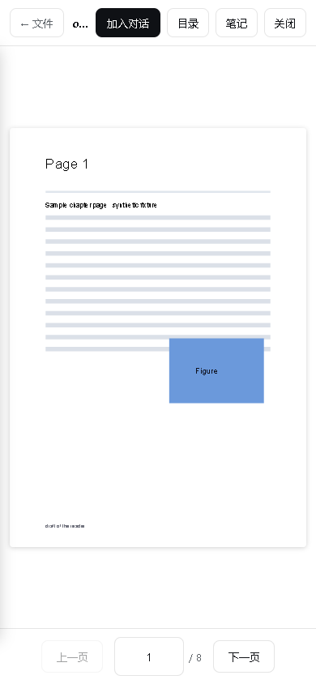

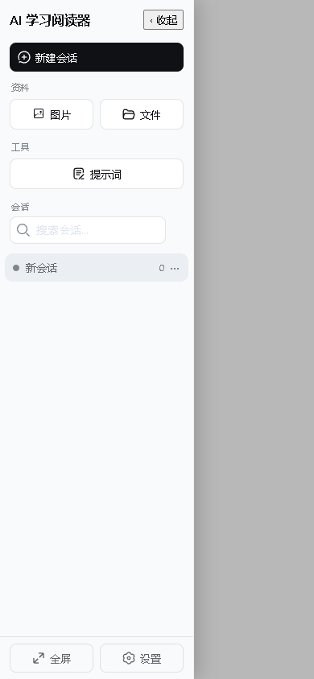

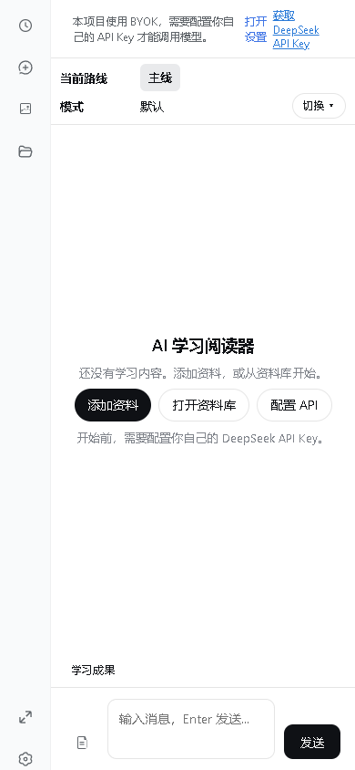

界面提供系统、浅色和深色三档外观，使用设计 token 控制颜色和交互状态，避免深色模式把正文变成刺眼的纯白。


### 7. Local-first、BYOK 和可恢复数据

浏览器本地保存元数据、会话、分支、设置、文档关系、页面笔记和 Prompt 学习配置；原始 PDF 与图片优先保存到 OPFS，不支持或写入失败时回退到 IndexedDB。完整 Backup V6 JSON 不包含 API Key，并兼容导入 V1–V5 备份。

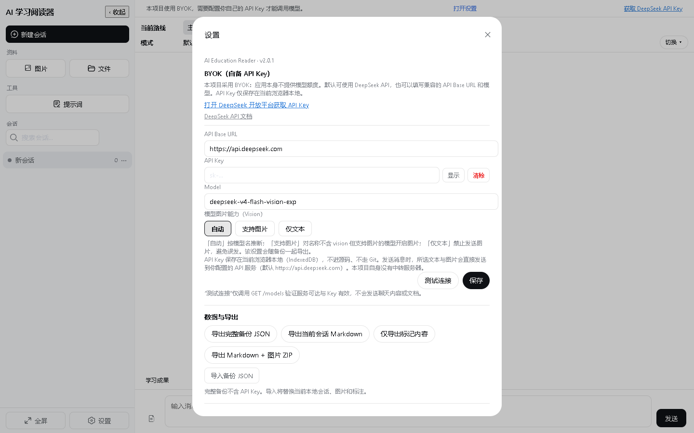

## 快速开始

**BYOK（Bring Your Own Key）**：应用本身不提供模型额度，需要你准备一个 DeepSeek API Key 或兼容 OpenAI 接口的服务。

1. 打开 [在线体验](https://beichen126.github.io/ai-education-reader/)；
2. 到 [DeepSeek 开放平台](https://platform.deepseek.com/) 获取 API Key；
3. 打开右下角「设置」，填入 API Base URL、Key 和模型；
4. 导入一份 PDF，等待它出现在「文件」资料库；
5. 打开 Reader，选择章节、页码或当前页加入对话；
6. 针对选中的 Context 提问，必要时在原文页继续做笔记或回看相关会话。

没有 API Key 也可以浏览资料库和 Reader，但不能调用模型。

## 隐私与本地优先

- **原始 PDF 不上传。** PDF 由 PDF.js 在浏览器本地读取和渲染。
- **模型请求由你发起。** 只有你显式选入 Context 或消息的内容，才会发送到你配置的 API。
- **没有产品后端。** 项目没有登录、账户、云同步或中转服务器。
- **API Key 只在本机保存。** Key 保存在当前浏览器的 IndexedDB，不写入源码、Git 或备份 JSON。
- **本地存储可迁移。** Backup V6 会保存文档关系、会话、分支、页面笔记、学习成果、Prompt 配置和附件元数据；旧 V1–V5 backup 仍可导入。

更完整的说明见 [PRIVACY.md](./PRIVACY.md)。

## 旧数据与版本兼容

兼容策略是“旧数据可读、新数据规范写入”：

- v1.3.0 已保存单一 `pdfContext` 的消息仍可参与 PDF 页面的反向查询；
- 新消息使用多来源 `pdfContexts`，可表达一条消息引用多个 PDF；
- 没有 provenance 的更早消息不会被猜测性回填；
- 旧附件没有 `documentId`，仍可显示和使用，但无法可靠地加入按文档反向查询；
- 重新导入同一文件会得到新的 Document ID，旧消息不会被错误地匹配到新文档。

## 架构概览

完整技术说明见 [docs/ARCHITECTURE.md](docs/ARCHITECTURE.md)。核心分层如下：

- **Document / Chapter / Context / Draft / Message / AI**：统一学习领域模型；
- **PDF runtime**：PDF.js worker、WASM、CMap、fonts 和 ICC 在浏览器内运行；
- **Document Library**：原始 PDF 独立于会话保存；
- **OPFS / IndexedDB**：二进制 OPFS-first，元数据和关系进入 IndexedDB；
- **Reader ↔ Conversation provenance**：文档页码与消息、分支保持可追溯关系；
- **异步所有权**：PdfSession、AbortController、generation token 和 note flush 保证切换与取消安全。

## 开发

```bash
npm install
npm run dev
npm run typecheck
npm test
npm run build
npm run test:release
npm run docs:screenshots
```

README 截图由 [scripts/capture-readme-assets.mjs](scripts/capture-readme-assets.mjs) 从 production build 生成，使用仓库内的确定性 PDF fixtures；不会读取个人资料或 API Key。测试分层与发布门禁见 [docs/TESTING.md](docs/TESTING.md)。

## 当前边界

- AI 调用依赖 BYOK，视觉能力取决于你配置的模型；
- 单次 PDF Context 最多 120 页，超过 30 页会二次确认；
- 完整备份为 Backup V6 JSON，大资料库导出时会产生 Base64 内存开销；
- 交互式 PDF JS、3D 和嵌入媒体不在范围内；
- PPT / PPTX 导入仍是 planned，不建设第二套 PPT Reader。

## Roadmap

详见 [docs/ROADMAP.md](docs/ROADMAP.md)。后续方向包括更大的上下文传输方式、完整的 PDF 阅读工作区、浏览器本地 PPTX → PDF 转换和 PWA 离线使用。

## 参与贡献

欢迎 PR 与 Issue。请使用仓库内的 Issue 模板，不要在 Issue 中提交 API Key、Backup JSON 或私人教材。

## License

[MIT](./LICENSE)。代码与设计 token 部分来自 DeepSeek Harness (DSH) 上游 Web UI（MIT，版权归 DeepSeek，见 [THIRD_PARTY_NOTICES](./THIRD_PARTY_NOTICES)）；PDF.js (pdfjs-dist) 为 Apache-2.0。
